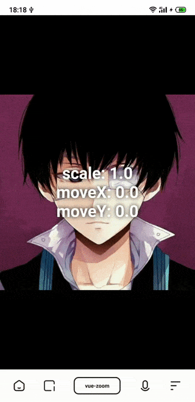

# vue-zoom

> Provide the mobile gesture scaling function for the child node（Vue2.x）

## Usage

### NPM

```
npm i @orez/vue-zoom
```
### Import Component

``` js
import Vue from 'vue'
import VueZoom from '@orez/vue-zoom'
import '@orez/vue-zoom/zoom.css'

Vue.use(VueZoom)

// ...
```

### CDN

```html
<!-- css -->
<link href="https://unpkg.com/@orez/vue-zoom/dist/zoom.css">

<!-- js -->
<script src="https://unpkg.com/vue"></script>
<script src="https://unpkg.com/@orez/vue-zoom/dist/zoom.umd.min.js"></script>
```

## API

#### props

| prop | descripton | type | default |
| -    | -          |:----:|:-------:|
| minZoom | - | `Number` | `1/3`
| maxZoom | - | `Number` | `3`
| debug | show debug info | `Boolean` | `false`

## Example



## License
[MIT](./LICENSE)